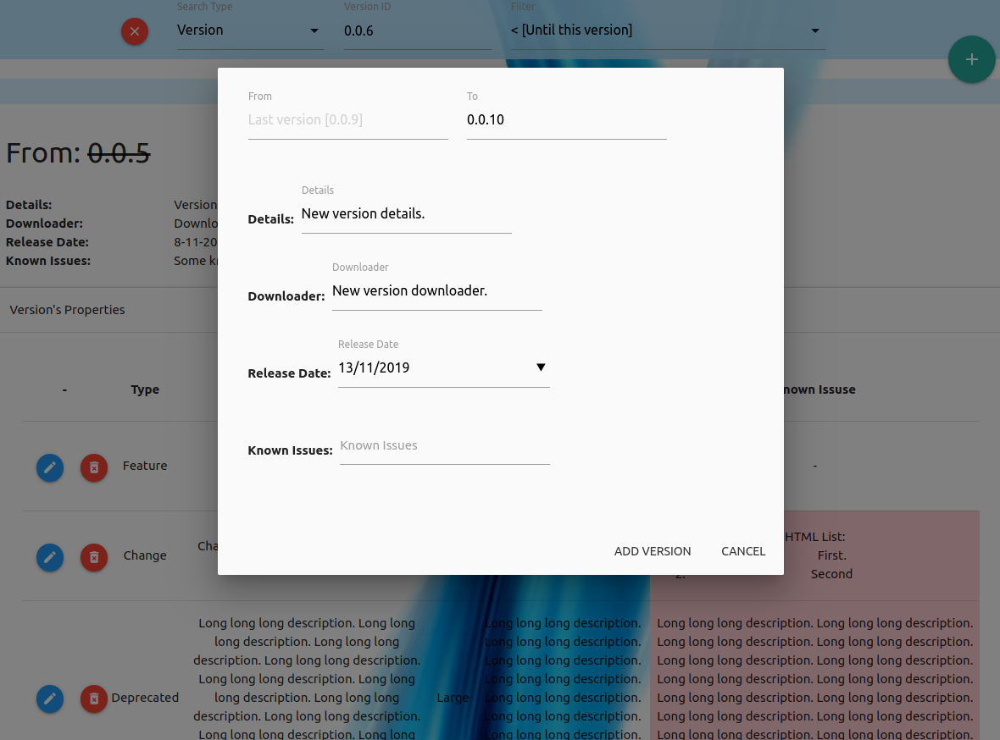

<!--[]()-->

# About Versions Track
Interactive web-based application to control issues & features, alongside development.
Mark and remember old issues with versions/dates/description oriented search.

**Compatible with offline systems.**

Table of Contents
=================
   * [About Versions Track](#about-versions-track)
   * [Table of Contents](#table-of-contents)
   * [Demo](#demo)
   * [Dependencies](#dependencies)
   * [Run](#run)
      * [Access Server](#access-server)
      * [Configuration](#configuration)
   * [Features](#features)
      * [Upcoming features](#upcoming-features)
         * [Next](#next)
   * [Pictures](#pictures)
      * [Versions Overview](#versions-overview)
      * [Search section](#search-section)
      * [Add new version](#add-new-version)
      * [Modify version](#modify-version)
      * [Modify version's property](#modify-versions-property)

# Demo
[demo - VersionsTrack](https://versions-track.herokuapp.com/)

# Dependencies
* [node.js](https://nodejs.org/en/).
* [mongodb](https://www.mongodb.com/).

# Run
```
sudo service mongod start # make sure to start mongodb sevice
node ./app.js
```

## Access Server
```
# On browser [chrome recommanded]: localhost:5000
```

## Configuration
At the first time you run the system (v2.0.0+), admin user is automatically generated.
```
username: admin
password: admin
```
You can modify this user after login into it using ```Sidebar -> Admin Panel -> Users Management -> admin```

WARNING! Don't lose your admin user credentials.

# Features
* Versions basic identifiers: Previous version id, This version id (e.g. From: 3.0.0 To: 3.0.1).
* Beta versions marking.
* Version properties: Unique changes that applied in specific version (e.g. Features, Solved Bugs, etc..).
* Versions search by version-id, version release date, and versions/properties descriptions.
* Users privileges:
    * Admin    -> Full access + Admin panel access.
    * Manager  -> Create / Delete / Modify versions/properties access.
    * User     -> Watch access.
    * Guest    -> Watch access.
    * Banned   -> No access at all.
* Admin Panel:
    * Users control panel (Add / Modify / Remove).
* Easy to use web-based interface, designed with [MaterializeCSS](https://materializecss.com/)
* Compatible with offline systems.
* Cross-Platform application.

## Upcoming features
* Limit versions count in a page.
* Limit properties count in a page.
* Order properties by type/tests scope.
* Add generic description options for versions.
* Properties/Versions short description TAGs.
* Edit profile:
    * Edit username/password.
    * Edit versions_in_page/properties_in_page.
    * Use user's versions_in_page/properties_in_page properties.

### Next
* Add discussion page for versions/properties.
* Multiple languages supporting.
* Users privileges:
    * User     -> Comment for issues in versions.
* Admin panel.
    * Background change option.
* JetBrains/Git integration.

# Pictures
## Versions Overview


## Search section


## Add new version


## Modify version


## Modify version's property
